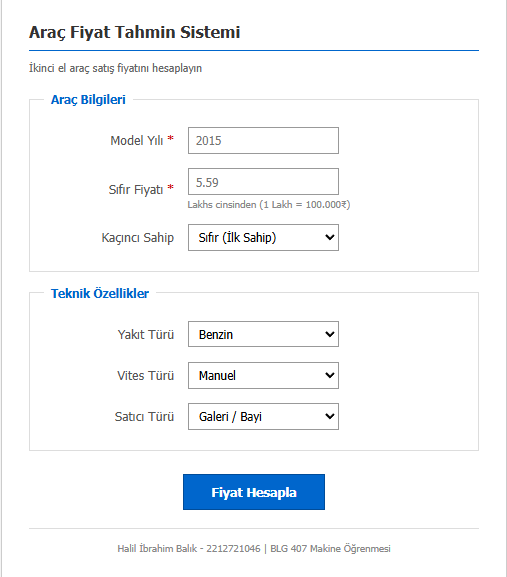
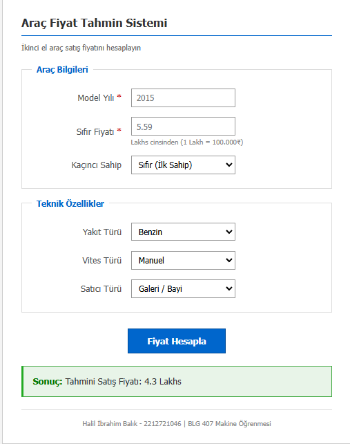

# İkinci El Araç Fiyat Tahmin Sistemi

Bu proje, BLG 407 Makine Öğrenmesi dersi 3. Proje Ödevi kapsamında geliştirilmiştir. Çoklu doğrusal regresyon yöntemi ile ikinci el araç satış fiyatı tahmini yapan bir model eğitilmiş ve Flask tabanlı web arayüzü ile sunulmuştur.

## Proje Bilgileri

| | |
|---|---|
| Ad Soyad | Halil İbrahim Balık |
| Okul Numarası | 2212721046 |
| Ders | BLG 407 - Makine Öğrenmesi |
| Dönem | 2025-2026 Güz |

## Veri Seti

Projede Kaggle platformundan elde edilen [Vehicle Dataset from CarDekho](https://www.kaggle.com/datasets/nehalbirla/vehicle-dataset-from-cardekho) veri seti kullanılmıştır. Veri seti 301 kayıt ve 9 özellik içermektedir. Hedef değişken `Selling_Price` olup Lakhs cinsinden ifade edilmektedir.

## 1. Veri Ön İşleme

### Öznitelik Seçimi

Orijinal veri setindeki 9 özellikten `Car_Name` ve `Kms_Driven` değişkenleri çıkarılmıştır. `Car_Name` sütunu çok sayıda benzersiz değer içerdiğinden kategorik dönüşüm için uygun bulunmamıştır. `Kms_Driven` değişkeni ise Backward Elimination sürecinde istatistiksel olarak anlamsız bulunarak elenmiştir. Final modelde 6 özellik kullanılmaktadır.

### Kayıp Veri Analizi

Veri seti `isnull().sum()` fonksiyonu ile kontrol edilmiş ve herhangi bir eksik değer tespit edilmemiştir. Bu nedenle silme veya doldurma işlemi uygulanmamıştır.

### Kategorik Verilerin Kodlanması

Veri setinde üç kategorik değişken bulunmaktadır: `Fuel_Type`, `Seller_Type` ve `Transmission`. Bu değişkenler için One-Hot Encoding yöntemi tercih edilmiştir. Label Encoding yerine One-Hot Encoding seçilmesinin nedeni, kategoriler arasında doğal bir sıralama ilişkisi bulunmamasıdır. Dummy variable trap probleminden kaçınmak için `drop_first=True` parametresi kullanılmıştır.

### Veri Ölçekleme

`Year` ve `Present_Price` değişkenleri farklı ölçeklerde olduğundan StandardScaler ile z-score normalizasyonu uygulanmıştır. Bu işlem, regresyon katsayılarının karşılaştırılabilir olmasını sağlamaktadır.

## 2. Backward Elimination

Özellik seçimi için statsmodels kütüphanesinin OLS modeli kullanılmıştır. İlk aşamada tüm özellikler modele dahil edilmiş ve p-value değerleri incelenmiştir. Belirlenen 0.05 anlamlılık eşiğinin üzerinde kalan `Fuel_Type_Petrol` değişkeni modelden çıkarılmıştır. Kalan tüm değişkenlerin p-value değerleri 0.05'in altında olduğundan eleme işlemi sonlandırılmıştır.

Final modelde kullanılan özellikler: `Year`, `Present_Price`, `Owner`, `Fuel_Type_Diesel`, `Seller_Type_Individual`, `Transmission_Manual`

## 3. Model Kurulumu ve Değerlendirme

Çoklu doğrusal regresyon modeli scikit-learn kütüphanesinin LinearRegression sınıfı ile eğitilmiştir. Veri seti %80 eğitim ve %20 test olacak şekilde bölünmüştür.

| Metrik | Değer |
|---|---|
| R² Score | 0.8473 |
| MAE | 1.2372 Lakhs |
| MSE | 3.5180 |
| RMSE | 1.8756 Lakhs |

R² değeri 0.8473 olarak elde edilmiştir. Bu değer, modelin hedef değişkendeki varyansın %84.73'sini açıklayabildiğini göstermektedir. MAE değeri 1.2372 Lakhs olup tahminlerin ortalama 1.2372 Lakhs sapma gösterdiğini ifade etmektedir. İkinci el araç fiyatlandırması için bu hata payı kabul edilebilir düzeydedir.

## 4. Flask Arayüz Uygulaması

Eğitilen model `pickle` modülü ile `model.pkl` dosyasına, StandardScaler nesnesi ise `scaler.pkl` dosyasına kaydedilmiştir. Flask framework kullanılarak geliştirilen web arayüzü, kullanıcıdan model yılı, sıfır fiyatı, sahiplik durumu, yakıt türü, vites türü ve satıcı türü bilgilerini almaktadır. Girilen değerler scaler ile ölçeklendikten sonra model üzerinden tahmin üretilmekte ve sonuç ekranda gösterilmektedir.

## Kurulum

```
git clone https://github.com/halilbalik/MLP_Flask.git
cd MLP_Flask
pip install -r requirements.txt
python app.py
```

Uygulama `http://127.0.0.1:5000` adresinde çalışacaktır.

## Dosya Yapısı

```
MLP_Flask/
├── odev3.ipynb
├── app.py
├── model.pkl
├── scaler.pkl
├── feature_columns.json
├── requirements.txt
├── templates/
│   └── index.html
└── screenshots/
    ├── flask_ui.png
    └── prediction_result.png
```

## Ekran Görüntüleri

### Ana Sayfa



### Tahmin Sonucu


